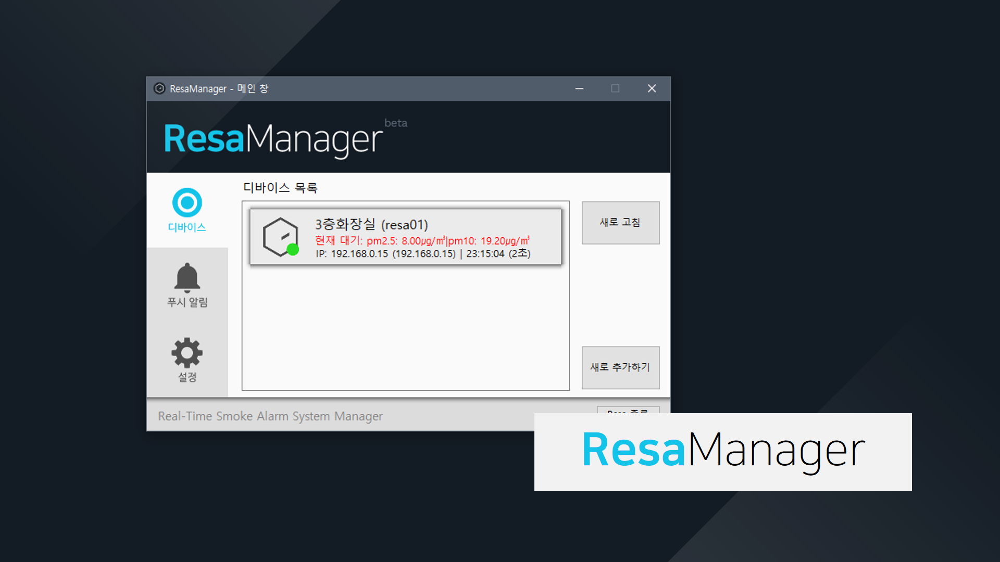

# ResaSystem
교내 실시간 연기 감지 알림 시스템(RESA) 코드 - 2018 교내피지컬컴퓨팅 창작대회 출품작

# 작동 환경
### ResaSystem (센서 장치)
- 미세먼지 센서 (SDS011) (2,3 핀 시리얼 통신)
- 아두이노 우노 보드
- 아두이노 이더넷 쉴드
- DFPlayer-mini mp3 재생 모듈
### ResaManager
- Windows 7+ OS가 설치된 PC
- .Net Framework 4.6.1

# 간략 소개 (ResaSystem)
본 프로젝트는 교내 흡연 감지/실시간 알림 시스템인 ResaSystem에서 감지 부분을 담당하는 장치를 아두이노를 통해 구현한 것으로, 아두이노에 이더넷 쉴드와 미세먼지 센서를 연결하여 ResaManager에서 원격으로 요청이 들어오면 대기 상태를 확인한 뒤 전송하는 역할을 하고 있습니다. 또한 mp3 재생 모듈과 스피커를 장착하여 연기 감지 시에 경보음을 울리고 음성 안내를 통해 연기가 감지되었음을 알리거나 ResaSystem 센서를 최초로 연결하였을때 ResaManager와 손쉽게 연결이 가능하도록 DHCP 등록 여부, IP Address 등을 알 수 있도록 하였습니다. ResaSystem과 Manager 간에는 대기 정보 뿐만 아니라 장치 상태, 설정 등도 통신이 가능하기 때문에 원격으로 장치를 재시작하거나 기능 테스트를 시행할 수도 있습니다.

# 작품 소개 전문

### 팀명 ( 팀원 )
- PBJSoft (21012 박동준)

### 제목

- 레사 Resa (Real-Time Smoke Alert System)

### 작품 제작 의도

 초등학교, 중학교를 거쳐 고등학생이 되어 학교생활을 하면서 꼭 주변에서 생기는 문제 중 하나가 있는데, 바로 흡연이다. 아직 정신적 그리고 신체적으로 성숙하지 못함에도 불구하고 주변 친구들의 권유나 아니면 멋을 부리고 싶다는 욕심 때문에 담배를 접하게 되는 친구들이 학교에서 꼭 하나 둘 나오기 마련이다.
 게다가 몇 년 전부터는 ‘전자 담배’ 가 등장하게 되었는데, ‘기존 담배에 비해 인체에 훨씬 덜 해롭다, 연기가 나지 않는다’ 는 등의 근거 없는 소문으로 많은 학생들이 담배를 접하게 되는 상황까지 벌어지게 되었다.
 
 이런 심각한 청소년 흡연 문제를 해결하기 위해서는 예방 교육과 교사들의 철저한 지도가 필요하다. 하지만 선생님 몰래 담배를 피는 학생들을 잡기란 쉬운 일이 아니다. 그래서 담당 지도 선생님들이 이런 담배에 빠진 학생들을 바로 파악하여 적절한 조치를 취할 수 있도록 도와주는 기기가 있으면 좋지 않을까 생각하게 되었다.
 
 또한 이전에 제작한 프로젝트였던 ‘몬지(monZi)’를 진행하면서 미세먼지, 대기상태 모니터링에 관련된 여러 경험들을 쌓았었는데, 이 경험을 살려 시중에 있는 미세먼지 센서와 웹 호스팅이 가능한 이더넷 쉴드를 장착한 아두이노를 결합하여 특정 장소에서 이 기기를 통해 대기 질을 실시간으로 받고, 이 값을 인터넷을 통해 선생님의 기기가 지속적으로 업데이트 하여 담배 연기를 감지하여 알림을 보낼 수 있겠다는 생각이 떠올랐다. 그리하여 실제 센서를 구해 값을 테스트해 보면서 이 프로젝트를 실제로 제작하게 되었다.

### 느낀 점

 이 프로젝트를 진행하면서 초반에 다소 걱정되었던 부분이 바로 ‘푸시 알림’ 부분이었다. 하지만 예상 외로 이 부분은 크로스 플랫폼을 지원하는 훌륭한 오픈 소스 메신저인 텔레그램의 API 덕분에 매우 쉽게 해결할 수 있었다.
 
 하지만 프로젝트를 진행하면서 발목을 잡았던 것은 의외로 내 바로 앞에 있었는데, 바로 내가 가지고 있던 아두이노 우노의 하드웨어적 한계였다. 아무래도 담배 연기를 감지하기 위해서는 지도 교사가 최대한 신속하게 감지 값을 업데이트 받아야 하기 때문에 컴퓨터(클라이언트)가 대기 정보를 자주 요청하게 되었는데, 업데이트가 다소 잦다 보니 자꾸 예상치 못한 문제가 발생하였다.
 
 예를 들자면 인터넷 연결은 정상적으로 되어 있지만 아무런 값을 출력하지 않는다던지, 센서가 올바르게 값을 받고 있지 않는다던지 하는 문제 등이 있었다. 하지만 결국 이러한 문제도 지속적으로 트러블슈팅을 해 보면서 PC의 소프트웨어가 (ResaManager) 실패 카운트를 지정하고 가끔씩 발생하는 오류에 대응할 수 있도록 프로그래밍하면서 어느 정도 해결할 수 있었다.
 
 이런 문제 밖에도 평소에는 항상 SW 프로젝트만 진행하다가 아두이노를 통해 피지컬 컴퓨팅 분야를 접해보면서 SW 프로젝트 진행에서는 느낄 수 없었던 뿌듯함을 느낄 수 있어서 좋았다. 앞으로 매우 유망할 것으로 보이는 IT 분야중 하나로 IoT가 있다고 하는데 앞으로도 이런 피지컬 컴퓨팅 분야의 프로젝트를 많이 도전해 봐야겠다는 생각이 든다.

2018년 11월 7일 수요일 오전 2:58:50
 
